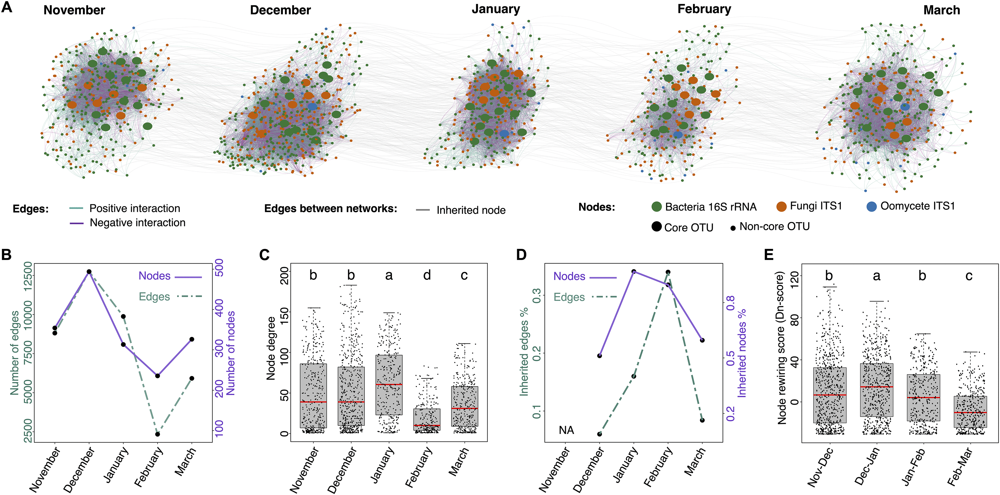

# TimeSeriesMicrobialNetworks

In this project, we collected and analyzed time-series leaf microbial networks. This repository contains the data, scripts, and results used in the manuscript:  
**"The Leaf Microbiome of Arabidopsis Displays Reproducible Dynamics and Patterns throughout the Growing Season"**, published in in [*mBio*](https://journals.asm.org/doi/10.1128/mbio.02825-21).

---

---


## Features
- **Comprehensive Data**: Includes OTU tables, taxonomy files, sample descriptions, and sequence data.  
- **Reproducible Scripts**: R scripts for generating figures, analyzing microbial networks, and statistical modeling.  
- **Detailed Results**: Outputs and visualizations for each figure and supplementary figure.  

- **Raw amplicon dataset**: Sequencing data are available under NCBI BioProject PRJNA438596

---

## Quick Start Guide

1. Clone the repository:  
   ```bash
   git clone https://github.com/yourusername/TimeSeriesMicrobialNetworks.git
   cd TimeSeriesMicrobialNetworks
   ```

2. Install dependencies for R:  
   ```r
   install.packages(c("vegan", "igraph", "ggplot2"))  # Add required packages as needed
   ```

3. Navigate the folders to access data and scripts for each figure:
   - **`script_data/Fig1/`**: Data and scripts for generating Figure 1.  
   - **`script_data/Fig2/`**: Data and scripts for Figure 2.  
   - And so on for Figures 3, 4, 5, and supplementary figures.

4. Run scripts to reproduce results. Example for Figure 1:  
   ```bash
   Rscript script_data/Fig1/scripts/composition_barplots.R
   ```

---


## Figures Overview

### Main Figures
- **Figure 1**: Microbial composition barplots.  
- **Figure 2**: Relative abundance and core analysis.  
- **Figure 3**: Diversity and richness trends.  
- **Figure 4**: Co-abundance network properties.  
- **Figure 5**: Hub identification in microbial networks.  

### Supplementary Figures
- **Sup Fig 1**: Multivariate analyses.  
- **Sup Fig 2**: Temporal changes in microbial communities.  
- **Sup Fig 3**: Occurrence patterns over multiple years.  
- **Sup Fig 4**: Hub identification using Spearman correlation.  

---

## Contributing
Contributions are welcome! If you wish to contribute, please fork this repository, create a feature branch, and submit a pull request.

---

## Support
For any inquiries, please contact [Maryam Mahmoudi](mailto:mahmoudimaryam70@gmail.com) or open an issue in this repository.
